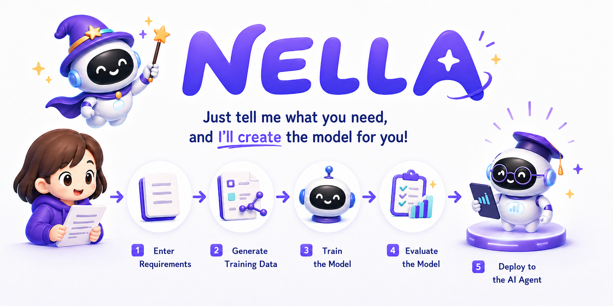

# NELLA

<div align="right">

[한국어](README.md) | **English**

</div>

<div align="center">
  
  <p>
    
    
    
  </p>
</div>

---

## 🆕 Latest News

> ### 🪟 Now installable with a **Windows installer**!
>
> You can run **NELLA** without Docker. Just download the installer and run it — no Python, Node.js, or Docker setup required.
>
> ➡️ **[Download the NELLA Windows installer](https://github.com/leeryong/NELLA/releases/latest)** (Windows 10/11, 64-bit)

> ### 🌐 Now on **TAW** — meet it as an agent!
>
> **NELLA** has joined **[The Agents Web (TAW)](https://github.com/leeryong/The_Agents_Web_TAW/blob/main/README.md)** as an **agent**. No install needed — with a single **TAW Browser**, meet it **anywhere on PC or mobile** (Windows · macOS · Linux · iOS · Android), via **chat or its web app**.
>
> ➡️ **[The Agents Web (TAW)](https://github.com/leeryong/The_Agents_Web_TAW/blob/main/README.md)** · 🌌 **[KISTI · BLUESKY](https://github.com/leeryong/KISTI_BLUESKY)**


## 🔎 Overview

### **NELLA (Nifty-Enhanced LLMOps Agent)**

**Just give it documents — an Agentic LLMOps agent that builds the model for you**

- **Conversational model-building environment**: Make a request in chat, and the NELLA agent automatically runs the entire process — from data generation to model training and evaluation
- **Usable by non-experts**: Build a domain-specialized LLM with natural-language instructions alone, without complex configuration
- **Human-in-the-Loop design**: The agent proposes a plan and the user approves it, delivering both automation and control at the same time
- **Security and practicality**: Build a customized LLM based on your organization's internal documents in a local environment

<div align="center">

<h3>
  <a href="https://www.youtube.com/watch?v=NWvAksoe4dE" 
     style="text-decoration: none; color: inherit;">
    📺 Demo Video (click to watch)
  </a>
</h3>

<a href="https://www.youtube.com/watch?v=NWvAksoe4dE">
  
</a>

</div>

  ## 🌐 NELLA Distribution Released

  The **NELLA distribution** is now publicly available so anyone in research, education, or everyday work can download and use it directly.

  ➡️ **[Go to the NELLA distribution (nella_source)](nella_source/)** — with Docker installed, a few commands like `docker compose up -d --build` run it right away (see Installation below)

---

## 🛠️ Installation

Pick either option. **On Windows, the installer is recommended.**

### Option 1 — Windows installer (recommended)

No Docker, no Python. Download one file and run it.

1. Download `NELLA-Setup-0.1.0.exe` from the **[releases page](https://github.com/leeryong/NELLA/releases/latest)**
2. Run the downloaded file (no administrator rights needed — it installs into your user folder)
3. Launch it from the **NELLA** desktop shortcut

- **Requirements**: Windows 10/11, 64-bit
- **GPU training**: CPU mode by default. If you have an NVIDIA GPU, add the CUDA training stack from *Settings → Install GPU training* in the app (~3 GB download, ~8 GB on disk after install). Restart the app afterwards to activate the GPU.

### Option 2 — Docker (Windows · macOS · Linux)

Everything needed to run NELLA is provided as Docker containers. With no separate Python or Node.js setup required, you can run NELLA with just a few commands as long as Docker is installed.

```bash
git clone https://github.com/leeryong/NELLA.git
cd NELLA/nella_source
docker compose up -d --build
```

The initial build takes 10–20 minutes to install dependencies. Once complete, open [http://localhost:3001](http://localhost:3001) to start using NELLA right away.

---

## 🚀 Key Features

- **Web UI–embedded NELLA agent**: Request model building, check progress, and give revision instructions via chat — all without leaving the workspace
- **Automatic training-data generation**: Automatically synthesizes SFT/DPO training data from document content and creates purpose-fit datasets
- **Data quality validation**: Reviews duplicate, low-quality, and malformed data and refines it into a dataset suitable for training
- **Automatic base-model recommendation**: Recommends and compares suitable base models considering multiple factors such as purpose, data scale, and local resources
- **Automatic hyperparameter tuning**: Automatically recommends and adjusts settings such as LoRA/QLoRA, epochs, and learning rate to match the training objective and evaluation results
- **Natural-language pipeline orchestration**: Analyzes the user's objective to automatically plan a 10-stage LLMOps pipeline and execute it step by step

<table>
<tr>
<td width="50%" align="center">

### 💬 An agent you delegate model building to via chat


<div align="left">
• Runs the entire pipeline automatically from a natural-language request<br>
• Check progress and give revision instructions in the in-workspace chat
</div>

</td>
<td width="50%" align="center">

### 📄 An agent that turns documents into training data


<div align="left">
• Automatically converts various formats such as PDF, DOCX, and HWP<br>
• Automatically synthesizes document-based datasets
</div>

</td>
</tr>
<tr>
<td width="50%" align="center">

### ⚙️ An agent that handles model training for you


<div align="left">
• Automatically sets hyperparameters and selects the training method<br>
• Automatically proposes data augmentation and retraining based on evaluation results
</div>

</td>
<td width="50%" align="center">

### ✅ An agent that evaluates and improves results


<div align="left">
• Supports diverse evaluation metrics such as BLEU, ROUGE, and LLM Judge<br>
• Chat-test the finished model right away
</div>

</td>
</tr>
</table>

---

## 🗂️ Supported Pipeline Stages

| Stage                       | Description                                              |
| --------------------------- | ------------------------------------------------------- |
| 1. Document Upload          | Analyze input documents (PDF, DOCX, HWP, etc.) and extract text |
| 2. Training Data Generation | Automatically synthesize SFT/DPO training data from documents   |
| 3. Data Validation          | Refine duplicate, low-quality, and malformed data       |
| 4. Base Model Selection     | Recommend and compare models based on purpose and resources |
| 5. Model Validation         | Compare candidate models' performance in advance        |
| 6. Model Training           | Automatically perform LoRA/QLoRA-based fine-tuning       |
| 7. Training Result Review   | Visualize learning curves and loss results              |
| 8. Model Evaluation         | Evaluate using BLEU, ROUGE, Perplexity, and LLM Judge   |
| 9. RAG DB Management        | Build and manage a document-based vector DB             |
| 10. Chat Test               | Chat-test the tuned model and RAG DB right away         |

---

## 📞 Contact
- Ryong Lee (ryonglee@kisti.re.kr)

---

## 👨‍💻 Development Team

KISTI **BLUESKY** Team — *Harmonizing Human and AI Collaboration* · [github.com/leeryong/KISTI_BLUESKY](https://github.com/leeryong/KISTI_BLUESKY)

- Ryong Lee (ryonglee@kisti.re.kr)
- Raeyoung Jang (raezero@kisti.re.kr)
- Jahyun Gu (jahyeongu@kisti.re.kr)

---

## 📚 Open-Source Acknowledgements
- [Ollama](https://github.com/ollama/ollama)
- [Hugging Face Transformers](https://github.com/huggingface/transformers)
- [PEFT](https://github.com/huggingface/peft)
- [TRL](https://github.com/huggingface/trl)
- [Docling](https://github.com/DS4SD/docling)
- [ChromaDB](https://github.com/chroma-core/chroma)
- [vLLM](https://github.com/vllm-project/vllm)
