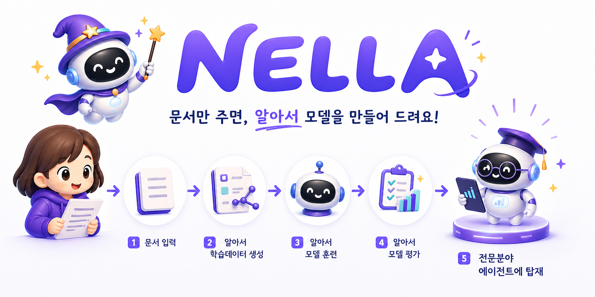
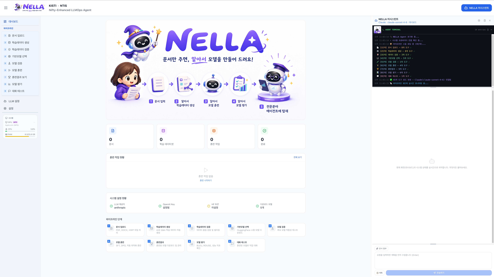
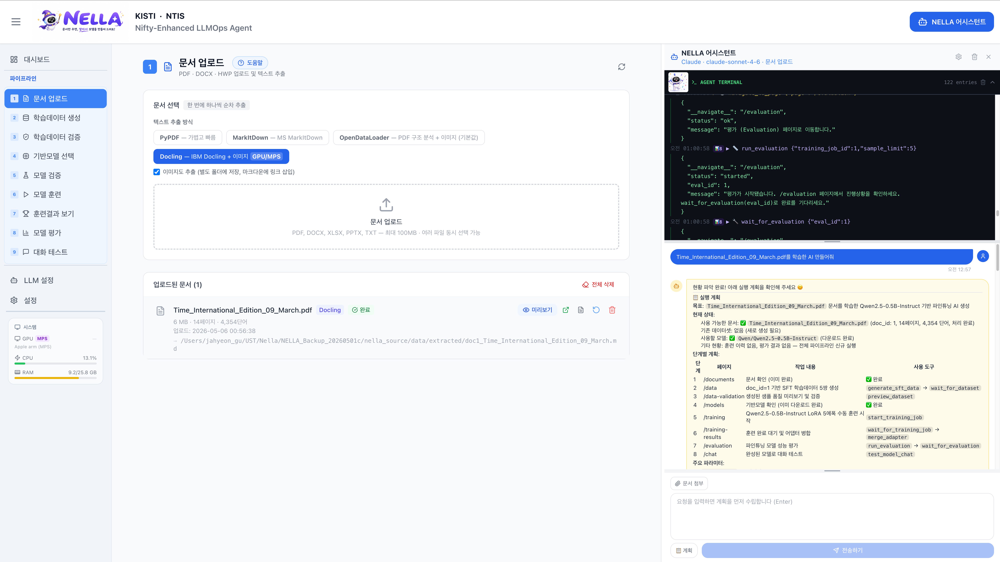
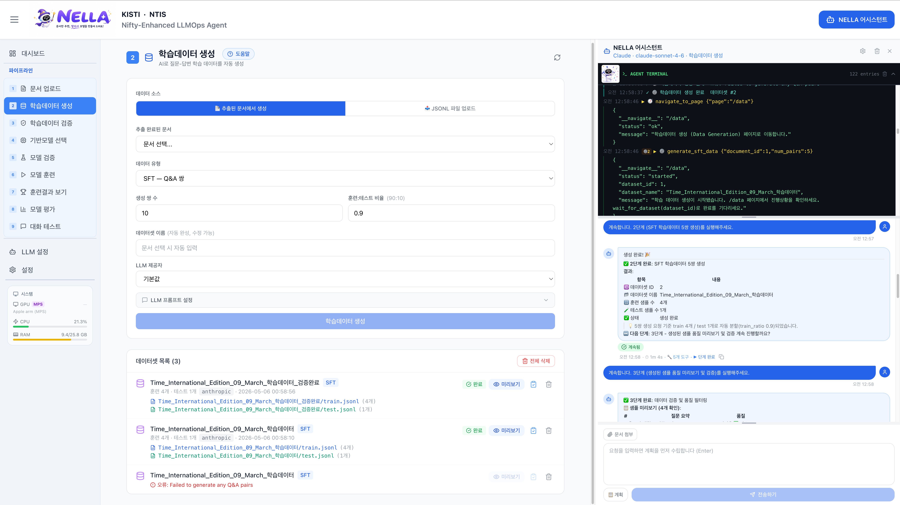
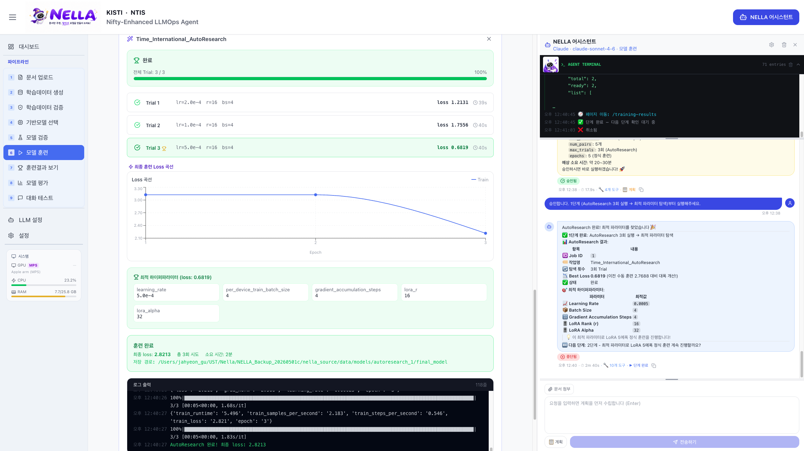
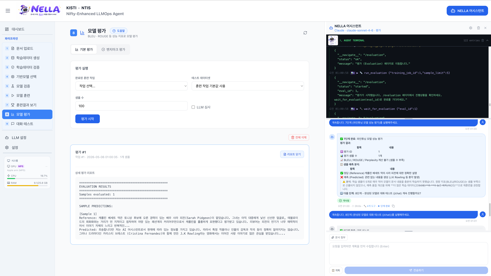

# NELLA

<div align="center">
  
  <p>
    
    
    
  </p>
</div>

---

## 🔎 개요

### **NELLA (Nifty-Enhanced LLMOps Agent)**

**문서만 주면, 알아서 모델을 만들어주는 Agentic LLMOps 에이전트**

- **대화형 모델 제작 환경**: 채팅으로 요청하면 NELLA 에이전트가 데이터 생성부터 모델 학습, 평가까지 전 과정을 자동 수행
- **비전문가도 사용 가능**: 복잡한 설정 없이 자연어 지시만으로 도메인 특화 LLM 제작 가능
- **Human-in-the-Loop 구조**: 에이전트가 계획을 제시하고 사용자가 승인하는 방식으로 자동화와 통제 가능성을 동시에 제공
- **보안성과 활용성**: 기관 내부 문서 기반 맞춤형 LLM을 로컬 환경에서 구축 가능

<div align="center">

<h3>
  <a href="https://www.youtube.com/watch?v=NWvAksoe4dE" 
     style="text-decoration: none; color: inherit;">
    📺 시연 영상 (클릭하여 보기)
  </a>
</h3>

<a href="https://www.youtube.com/watch?v=NWvAksoe4dE">
  
</a>

</div>

---

## 🛠️ 설치 방법

NELLA 설치에 필요한 모든 구성 요소는 Docker 컨테이너로 제공됩니다. 별도의 Python 또는 Node.js 환경 설정 없이 Docker만 설치되어 있다면, 아래 명령 몇 줄만으로 NELLA를 바로 실행할 수 있습니다.

```bash
git clone https://github.com/leeryong/NELLA.git
cd NELLA/nella_source
docker compose up -d --build
```

최초 빌드는 의존성 설치로 10~20분 걸리며, 완료 후 [http://localhost:3001](http://localhost:3001) 에 접속하여 바로 NELLA를 사용해볼 수 있습니다.

---

## 🚀 주요 기능

- **웹 UI 내장형 NELLA 에이전트**: 작업 화면을 벗어나지 않고 채팅으로 모델 제작 요청, 진행 확인, 수정 지시 가능
- **자동 학습 데이터 생성**: 문서 내용 기반 SFT/DPO 학습 데이터를 자동 합성하고 목적에 맞는 데이터셋 생성
- **데이터 품질 검증**: 중복, 품질 저하, 형식 오류 데이터를 검토하여 학습에 적합한 데이터셋으로 정제
- **기반 모델 자동 추천**: 사용 목적, 데이터 규모, 로컬 자원 등 여러 조건을 고려해 적합한 기반 모델 추천 및 비교
- **하이퍼파라미터 자동 조정**: LoRA/QLoRA, epoch, learning rate 등 설정을 학습 목적과 평가 결과에 맞게 자동 추천 및 조정
- **자연어 기반 파이프라인 오케스트레이션**: 사용자의 목적을 분석해 9단계 LLMOps 파이프라인을 자동 계획하고 단계별 실행

<table>
<tr>
<td width="50%" align="center">

### 💬 채팅으로 모델 제작을 맡기는 에이전트


<div align="left">
• 자연어 요청만으로 전체 파이프라인 자동 실행<br>
• 작업 화면 내 채팅창에서 진행 확인 및 수정 지시 가능
</div>

</td>
<td width="50%" align="center">

### 📄 문서에서 학습 데이터를 만드는 에이전트


<div align="left">
• PDF, DOCX, HWP 등 다양한 형식 자동 변환<br>
• 문서 기반 데이터셋 자동 합성
</div>

</td>
</tr>
<tr>
<td width="50%" align="center">

### ⚙️ 모델 훈련을 알아서 하는 에이전트


<div align="left">
• 하이퍼파라미터 자동 설정 및 학습 방식 선택<br>
• 평가 결과 기반 데이터 보강 및 재학습 자동 제안
</div>

</td>
<td width="50%" align="center">

### ✅ 결과를 평가하고 개선하는 에이전트


<div align="left">
• BLEU, ROUGE, LLM Judge 등 다양한 평가 지표 지원<br>
• 완성된 모델과 즉시 대화 테스트 가능
</div>

</td>
</tr>
</table>

---

## 🗂️ 지원 파이프라인 단계

| 단계           | 설명                                       |
| ------------ | ---------------------------------------- |
| 1. 문서 업로드    | PDF, DOCX, HWP 등 입력 문서 분석 및 텍스트 추출       |
| 2. 학습 데이터 생성 | 문서 기반 SFT/DPO 학습 데이터 자동 합성               |
| 3. 데이터 검증    | 중복, 품질 저하, 형식 오류 데이터 정제                  |
| 4. 기반 모델 선택  | 목적, 자원 기반 모델 추천 및 비교                     |
| 5. 모델 검증     | 후보 모델 사전 성능 비교                           |
| 6. 모델 훈련     | LoRA/QLoRA 기반 파인튜닝 자동 수행                 |
| 7. 훈련 결과 확인  | 학습 곡선 및 손실 결과 시각화                        |
| 8. 모델 평가     | BLEU, ROUGE, Perplexity, LLM Judge 기반 평가 |
| 9. 대화 테스트    | 튜닝된 모델과 즉시 대화 테스트                        |

---

## 📞 문의
- 이용 (ryonglee@kisti.re.kr)

---

## 👨‍💻 개발자 그룹

KISTI **BLUESKY** 팀 — *Harmonizing Human and AI Collaboration* · [github.com/leeryong/KISTI_BLUESKY](https://github.com/leeryong/KISTI_BLUESKY)

- 이용 (ryonglee@kisti.re.kr)
- 장래영 (raezero@kisti.re.kr)
- 구자현 (jahyeongu@kisti.re.kr)

---

## 📚 활용 공개 소스
- [Ollama](https://github.com/ollama/ollama)
- [Hugging Face Transformers](https://github.com/huggingface/transformers)
- [PEFT](https://github.com/huggingface/peft)
- [TRL](https://github.com/huggingface/trl)
- [Docling](https://github.com/DS4SD/docling)
- [ChromaDB](https://github.com/chroma-core/chroma)
- [vLLM](https://github.com/vllm-project/vllm)
