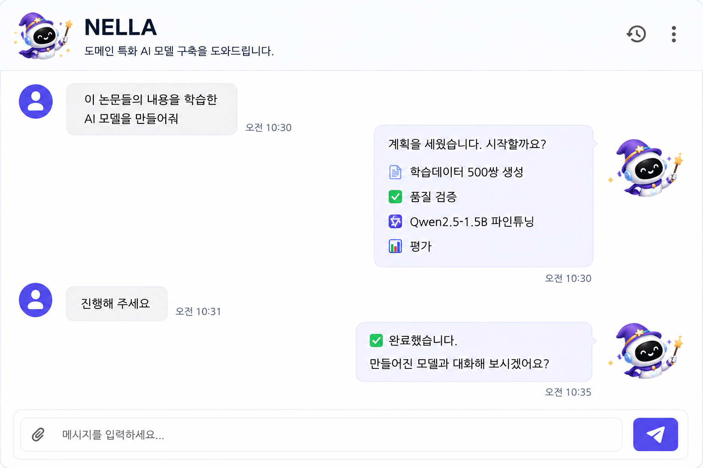

# NELLA

<div align="right">

**한국어** | [English](README.en.md)

</div>

<div align="center">
  
  <p>
    
    
    
    
  </p>
</div>

---

<div align="center">

## 나만의 AI 모델 제작 도우미, **NELLA**

#### 문서를 올리고, 한 마디만 하세요.

</div>

<div align="center">
  
</div>

**AI 모델 만드는 법을 몰라도 됩니다.**
데이터 가공도, 모델 선택도, 하이퍼파라미터도 **NELLA가 도와드릴게요.** 승인만 해 주시면 됩니다.

NELLA는 **내 문서를 학습한 AI 모델**을 만들어 주는 프로그램입니다. 클라우드 서비스가 아니라 내 PC에 설치해서 씁니다.

- 📄 **문서가 그대로 재료가 됩니다** — PDF·워드·한글 문서를 올려 두면 학습용 문답을 자동으로 만들고, 품질이 떨어지는 것은 걸러 냅니다.
- 💬 **대화로 시킵니다** — 채팅창에 한 마디만 하면 기반 모델 선택부터 학습·채점까지 순서대로 진행하고, 단계마다 승인을 받습니다.
- 🏠 **내 PC 안에서 만듭니다** — 문서도 완성된 모델도 내 컴퓨터(또는 기관 서버)에 있습니다. 만든 모델은 파일로 내려받아 동료와 나눠 쓸 수 있습니다.
- 📚 **찾아보고 답하게도 합니다** — 학습시키는 것 말고, 문서를 검색해 근거를 들어 답하는 방식(RAG)도 함께 지원합니다.

| 이런 분께 | |
| --- | --- |
| 📚 **연구자** | 논문·실험 자료를 학습한 전용 모델로 자료 검색·요약 |
| 🏛️ **기관 담당자** | 내부 규정·매뉴얼을 아는 업무 도우미를 기관 환경에 구축 |
| 🎓 **교육자·학생** | 강의 자료 기반 학습 도우미 제작, LLMOps 전 과정 실습 |

<div align="center">

**[⬇️ Windows 설치 파일 받기](https://github.com/leeryong/NELLA/releases/latest)** · **[📺 시연 영상 보기](https://www.youtube.com/watch?v=NWvAksoe4dE)** · **[🛠️ 설치 방법](#install)**

</div>

---

<a id="toc"></a>

## 📑 목차

| 섹션 | 내용 |
| --- | --- |
| [🆕 최신 소식](#news) | Windows 설치 파일, TAW 에이전트 |
| [🎬 주요 화면](#what) | 시연 영상, 에이전트 화면 |
| [🗂️ 파이프라인 10단계](#pipeline) | 단계별 작업 내용 |
| [🚀 주요 기능](#features) | 자동화 항목 |
| [✅ 시작 전 준비물](#prepare) | API 키, GPU, HF 토큰 |
| [🛠️ 설치 방법](#install) | Windows 설치 파일, Docker |
| [📞 문의](#contact) | 연락처 |
| [👨‍💻 개발자 그룹](#team) | KISTI BLUESKY 팀 |
| [📚 활용 공개 소스](#oss) | 사용 오픈소스 |

---

<a id="news"></a>

## 🆕 최신 소식

> ### 🪟 이제 **Windows 설치 파일**로 바로 설치하세요!
>
> Docker 없이도 **NELLA**를 쓸 수 있습니다. 설치 파일을 내려받아 실행하면 끝 — Python·Node.js·Docker 설정이 필요 없습니다.
>
> ➡️ **[NELLA Windows 설치 파일 내려받기](https://github.com/leeryong/NELLA/releases/latest)** (Windows 10/11 64비트)

> ### 🌐 이제 **TAW**에서 에이전트로 만나요!
>
> **NELLA** — 이제 **[The Agents Web (TAW)](https://github.com/leeryong/The_Agents_Web_TAW/blob/main/README.ko.md)** 플랫폼에서 **에이전트**로 만날 수 있습니다!
> 설치 없이 **TAW Browser** 하나로 **PC·모바일 어디서나**(Windows · macOS · Linux · iOS · Android), **대화로도 웹앱으로도** 바로 쓰세요.
>
> ➡️ **[The Agents Web (TAW)](https://github.com/leeryong/The_Agents_Web_TAW/blob/main/README.ko.md)** · 🌌 **[KISTI · BLUESKY](https://github.com/leeryong/KISTI_BLUESKY)**

<div align="right"><a href="#toc">▲ 목차로</a></div>

---

<a id="what"></a>

## 🎬 주요 화면

<div align="center">

<h3>
  <a href="https://www.youtube.com/watch?v=NWvAksoe4dE"
     style="text-decoration: none; color: inherit;">
    📺 시연 영상 (클릭하여 보기)
  </a>
</h3>

<a href="https://www.youtube.com/watch?v=NWvAksoe4dE">
  
</a>

</div>

<table>
<tr>
<td width="50%" align="center">

### 💬 채팅으로 모델 제작을 맡기는 에이전트


<div align="left">
• 자연어 요청만으로 전체 파이프라인 자동 실행<br>
• 작업 화면 내 채팅창에서 진행 확인 및 수정 지시 가능
</div>

</td>
<td width="50%" align="center">

### 📄 문서에서 학습 데이터를 만드는 에이전트


<div align="left">
• PDF, DOCX, HWP 등 다양한 형식 자동 변환<br>
• 문서 기반 데이터셋 자동 합성
</div>

</td>
</tr>
<tr>
<td width="50%" align="center">

### ⚙️ 모델 훈련을 알아서 하는 에이전트


<div align="left">
• 하이퍼파라미터 자동 설정 및 학습 방식 선택<br>
• 평가 결과 기반 데이터 보강 및 재학습 자동 제안
</div>

</td>
<td width="50%" align="center">

### ✅ 결과를 평가하고 개선하는 에이전트


<div align="left">
• BLEU, ROUGE, LLM Judge 등 다양한 평가 지표 지원<br>
• 완성된 모델과 즉시 대화 테스트 가능
</div>

</td>
</tr>
</table>

<div align="right"><a href="#toc">▲ 목차로</a></div>

---

<a id="pipeline"></a>

## 🗂️ 파이프라인 10단계

문서를 올린 뒤 대화 테스트까지, NELLA가 아래 순서를 자동으로 진행합니다.
각 단계는 **직접 조작할 수도 있고**, 채팅으로 **한 번에 맡길 수도** 있습니다.

```
📄 문서 → 📝 학습데이터 → 🔍 검증 → 🤖 모델선택 → 🧪 사전검증 → ⚙️ 훈련
   → 📈 결과확인 → 📊 평가 → 📚 RAG DB → 💬 대화 테스트
```

| 단계 | 하는 일 | 의미 |
| --- | --- | --- |
| **1. 문서 업로드** | PDF·DOCX·HWP 텍스트 추출 | 자료를 읽을 수 있게 만듭니다 |
| **2. 학습데이터 생성** | 문서 기반 QA·DPO 데이터 자동 합성 | 문서로 **문제집**을 만듭니다 |
| **3. 데이터 검증** | 규칙·LLM 기반 품질 평가 및 정제 | 이상한 문제를 **걸러냅니다** |
| **4. 기반모델 선택** | HuggingFace 모델 검색·다운로드 | 학습시킬 **기반 모델**을 고릅니다 |
| **5. 모델 검증** | Scout 기반 유망 모델 사전 예측 | 모델들의 **학습 효과를 예측**합니다 |
| **6. 모델 훈련** | SFT·DPO·AutoResearch 파인튜닝 | 실제로 **공부시킵니다** |
| **7. 훈련결과** | 학습 곡선 확인, LoRA 병합·다운로드 | 잘 배웠는지 **확인합니다** |
| **8. 모델 평가** | BLEU·ROUGE·Perplexity·LLM Judge | 성적을 **채점합니다** |
| **9. RAG DB 관리** | 문서 기반 벡터DB(ChromaDB) 구축 | **오픈북**처럼 문서를 참고해 답하게 합니다 |
| **10. 대화 테스트** | 학습된 모델·RAG DB와 직접 대화 | 완성된 모델과 **대화합니다** |

> 💡 앱 안의 **‘가이드 열기’** 버튼을 누르면 각 단계별 상세 사용법을 볼 수 있습니다.

<div align="right"><a href="#toc">▲ 목차로</a></div>

---

<a id="features"></a>

## 🚀 주요 기능

- **웹 UI 내장형 NELLA 에이전트**: 작업 화면을 벗어나지 않고 채팅으로 모델 제작 요청, 진행 확인, 수정 지시 가능
- **자동 학습 데이터 생성**: 문서 내용 기반 SFT/DPO 학습 데이터를 자동 합성하고 목적에 맞는 데이터셋 생성
- **데이터 품질 검증**: 중복, 품질 저하, 형식 오류 데이터를 검토하여 학습에 적합한 데이터셋으로 정제
- **기반 모델 자동 추천**: 사용 목적, 데이터 규모, 로컬 자원 등 여러 조건을 고려해 적합한 기반 모델 추천 및 비교
- **하이퍼파라미터 자동 조정**: LoRA/QLoRA, epoch, learning rate 등 설정을 학습 목적과 평가 결과에 맞게 자동 추천 및 조정
- **자연어 기반 파이프라인 오케스트레이션**: 사용자의 목적을 분석해 10단계 LLMOps 파이프라인을 자동 계획하고 단계별 실행
- **Human-in-the-Loop**: 에이전트가 계획을 제시하고 사용자가 승인 — 자동화와 통제를 동시에

<div align="right"><a href="#toc">▲ 목차로</a></div>

---

<a id="prepare"></a>

## ✅ 시작 전 준비물

| 준비물 | 필요한 이유 | 없으면 |
| --- | --- | --- |
| **LLM API 키**<br>(OpenAI 또는 Anthropic) | 학습데이터 생성·평가에 사용 | 2·3·8단계 사용 제한 |
| **NVIDIA GPU** | 모델 훈련·추론에 사용 | 문서 처리·데이터 생성은 가능, 훈련은 어려움 |
| **HuggingFace 토큰** | Llama·Gemma 등 라이선스 동의 모델 다운로드 | 동의 불필요한 모델만 사용 가능 |

- API 키는 설치 후 **‘LLM 설정’** 화면에서 등록합니다. 코드 수정이 필요 없습니다.
- GPU는 **8GB VRAM**부터 소형 모델 학습이 가능하고, 13B급 모델은 **24GB**를 권장합니다.

<div align="right"><a href="#toc">▲ 목차로</a></div>

---

<a id="install"></a>

## 🛠️ 설치 방법

두 가지 방법 중 하나를 선택하세요. **Windows 사용자는 설치 파일 방식을 권장합니다.**

### 방법 1 — Windows 설치 파일 (권장)

Docker도, Python도 필요 없습니다. 설치 파일 하나만 받아 실행하면 됩니다.

1. **[릴리스 페이지](https://github.com/leeryong/NELLA/releases/latest)** 에서 `NELLA-Setup-0.1.0.exe` 를 내려받습니다
2. 내려받은 파일을 실행합니다 (관리자 권한 불필요 — 사용자 폴더에 설치됩니다)
3. 바탕화면의 **NELLA** 아이콘으로 실행합니다

- **요구 사항**: Windows 10/11 64비트
- **GPU 학습**: 기본은 CPU 모드입니다. NVIDIA GPU가 있다면 앱의 *설정 → GPU 학습 기능 설치* 버튼으로 CUDA 학습 스택을 추가할 수 있습니다 (다운로드 약 3GB, 설치 후 약 8GB 필요). 설치 후 앱을 재시작하면 GPU가 활성화됩니다.

### 방법 2 — Docker (Windows · macOS · Linux)

NELLA 실행에 필요한 모든 구성 요소가 Docker 컨테이너로 제공됩니다. 별도의 Python 또는 Node.js 환경 설정 없이 Docker만 설치되어 있다면, 아래 명령 몇 줄만으로 실행할 수 있습니다.

```bash
git clone https://github.com/leeryong/NELLA.git
cd NELLA/nella_source
docker compose up -d --build
```

최초 빌드는 의존성 설치로 10~20분 걸리며, 완료 후 [http://localhost:3001](http://localhost:3001) 에 접속하여 바로 NELLA를 사용해볼 수 있습니다.

**NVIDIA GPU로 실행하려면** 아래처럼 GPU 오버레이를 함께 지정하세요. Docker는 CUDA 라이브러리는 이미지에 담아 주지만 GPU 장치는 따로 열어 줘야 합니다.

```bash
docker compose -f docker-compose.yml -f docker-compose.gpu.yml up -d --build
```

기본 명령(위쪽)은 GPU가 없는 환경에서도 동작하도록 CPU 모드로 실행됩니다. Linux에서는 [NVIDIA Container Toolkit](https://docs.nvidia.com/datacenter/cloud-native/container-toolkit/latest/install-guide.html)이 필요하고, Windows의 Docker Desktop은 WSL2를 통해 별도 설치 없이 동작합니다.

<div align="right"><a href="#toc">▲ 목차로</a></div>

---

<a id="contact"></a>

## 📞 문의
- 이용 (ryonglee@kisti.re.kr)

---

<a id="team"></a>

## 👨‍💻 개발자 그룹

KISTI **BLUESKY** 팀 — *Harmonizing Human and AI Collaboration* · [github.com/leeryong/KISTI_BLUESKY](https://github.com/leeryong/KISTI_BLUESKY)

- 이용 (ryonglee@kisti.re.kr)
- 장래영 (raezero@kisti.re.kr)
- 구자현 (jahyeongu@kisti.re.kr)

---

<a id="oss"></a>

## 📚 활용 공개 소스
- [Ollama](https://github.com/ollama/ollama)
- [Hugging Face Transformers](https://github.com/huggingface/transformers)
- [PEFT](https://github.com/huggingface/peft)
- [TRL](https://github.com/huggingface/trl)
- [Docling](https://github.com/DS4SD/docling)
- [ChromaDB](https://github.com/chroma-core/chroma)
- [vLLM](https://github.com/vllm-project/vllm)

<div align="right"><a href="#toc">▲ 목차로</a></div>
